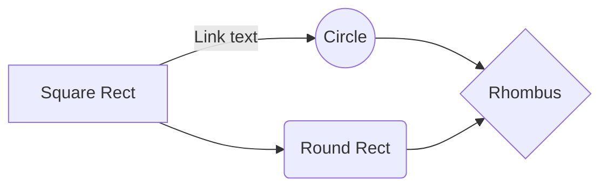

### Hi there 👋

**Ma2Ri2aL/Ma2Ri2aL** is a ✨ _special_ ✨ repository because its `README.md` (this file) appears on your GitHub profile.

Here are some ideas to get you started:

- 🔭 I’m currently working on ...
- 🌱 I’m currently learning ...
- 👯 I’m looking to collaborate on ...
- 🤔 I’m looking for help with ...
- 💬 Ask me about ...
- 📫 How to reach me: ...
- 😄 Pronouns: ...
- ⚡ Fun fact: ...

# Mazrizal Abdullah
## Mazrizal Abdullah
### Mazrizal Abdullah

[GitHub Saya...](https://github.com/Ma2Ri2aL)

# Welcome to Mazrizal Page!

Hi! I'm your first Markdown file in **Mazrizal Github**. If you want to learn about StackEdit, you can read me. If you want to play with Markdown, you can edit me. Once you have finished with me, you can create new files by opening the **file upload/download** on the left corner of the navigation bar.

## Delete a file

You can delete the current file by clicking the **Musnahkan** button in the file explorer. The file will be moved into the **Tempat Buang File** folder and automatically deleted after 7 days of inactivity.

## SmartyPants

SmartyPants converts Motivasi punctuation characters into "smart" typographic punctuation HTML entities. For example:

|                |Motivasi                          |Result                        |
|----------------|-------------------------------|-----------------------------|
|Single backticks|`'Isn't this fun?'`            |'Isn't this fun?'            |
|Quotes          |`"Isn't this fun?"`            |"Isn't this fun?"            |
|Dashes          |`-- is en-dash, --- is em-dash`|-- is en-dash, --- is em-dash|

## KaTeX

You can render LaTeX mathematical expressions using [KaTeX](https://khan.github.io/KaTeX/):

The *Gamma function* satisfying $\Gamma(n) = (n-1)!\quad\forall n\in\mathbb N$ is via the Euler integral

$$
\Gamma(z) = \int_0^\infty t^{z-1}e^{-t}dt\,.
$$

> You can find more information about **LaTeX** mathematical expressions [here](http://meta.math.stackexchange.com/questions/5020/mathjax-basic-tutorial-and-quick-reference).

And this will produce a flow chart:

